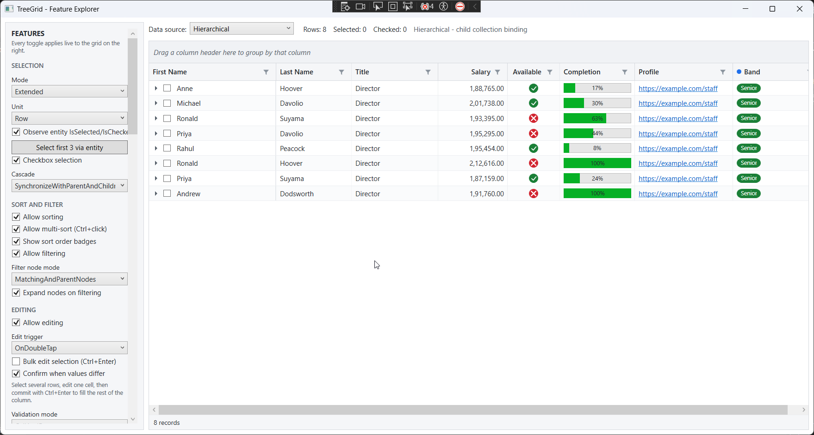
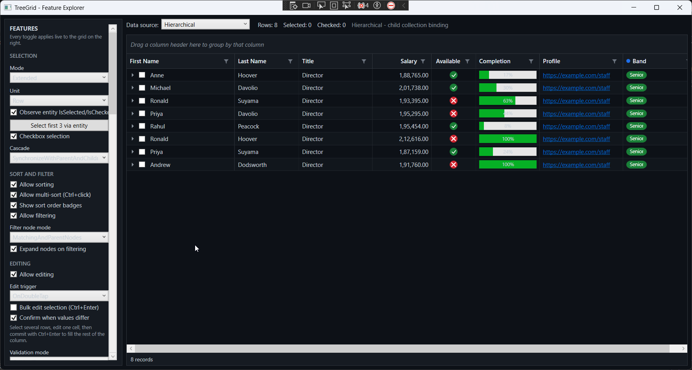
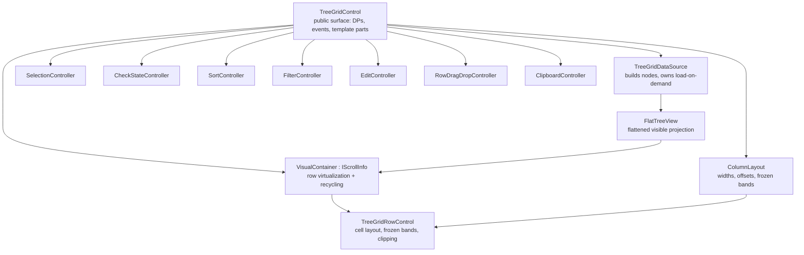

# TreeGrid.Wpf

[](https://www.nuget.org/packages/TreeGrid.Wpf/)
[](https://www.nuget.org/packages/TreeGrid.Wpf.Export/)
[](https://www.nuget.org/packages/TreeGrid.Wpf/)
[](LICENSE)

A multi-column tree grid for WPF, built from scratch for .NET 8. Hierarchical data
binding, row and column virtualization, sorting, Excel-style filtering, editing with
four validation sources, frozen panes, stacked headers, drag-and-drop, clipboard
interop, and export to Excel, CSV and PDF.

Clean-room implementation. No third-party control assemblies are referenced or
decompiled, and the core library has no external dependencies at all.

```bash
dotnet add package TreeGrid.Wpf
dotnet add package TreeGrid.Wpf.Export   # optional: Excel and PDF export
```

```xml
<tg:TreeGridControl ItemsSource="{Binding Staff}"
                    ChildPropertyName="Children"
                    AllowSorting="True"
                    AllowFiltering="True"
                    FrozenColumnCount="1">
    <tg:TreeGridControl.Columns>
        <cols:TreeGridTextColumn MappingName="FirstName" HeaderText="First Name" Width="220" />
        <cols:TreeGridNumericColumn MappingName="Salary" HeaderText="Salary" Width="110" />
        <cols:TreeGridProgressBarColumn MappingName="Completion" HeaderText="Progress" />
    </tg:TreeGridControl.Columns>
</tg:TreeGridControl>
```

---

## Contents

- [Screenshots](#screenshots)
- [Installation](#installation)
- [Requirements and build](#requirements-and-build)
- [Projects](#projects)
- [Quick start](#quick-start)
- [Architecture](#architecture)
- [Data binding](#data-binding)
- [Virtualization](#virtualization)
- [Columns](#columns)
- [Footer](#footer)
- [Selection](#selection)
- [Grouping](#grouping)
- [Sorting](#sorting)
- [Filtering](#filtering)
- [Editing and validation](#editing-and-validation)
- [Frozen panes and stacked headers](#frozen-panes-and-stacked-headers)
- [Row drag and drop](#row-drag-and-drop)
- [Context menus](#context-menus)
- [Clipboard](#clipboard)
- [Export](#export)
- [Appearance and conditional formatting](#appearance-and-conditional-formatting)
- [Theming](#theming)
- [Localization and RTL](#localization-and-rtl)
- [Keyboard reference](#keyboard-reference)
- [Diagnostics](#diagnostics)
- [Events reference](#events-reference)
- [Known limitations](#known-limitations)
- [Licence](#licence)

---

## Screenshots

The demo's feature explorer (`samples/TreeGrid.Demo`): every toggle in the sidebar
applies live to the grid. Shown here with checkbox selection, filter buttons, the
group-by panel, and boolean-icon, progress-bar, hyperlink and badge columns.

**Light theme**



**Dark theme** — a brush-only resource dictionary swap; the sidebar and chrome follow



---

## Installation

| Package | NuGet | Install |
|---|---|---|
| [TreeGrid.Wpf](https://www.nuget.org/packages/TreeGrid.Wpf/) | [](https://www.nuget.org/packages/TreeGrid.Wpf/) | `dotnet add package TreeGrid.Wpf` |
| [TreeGrid.Wpf.Export](https://www.nuget.org/packages/TreeGrid.Wpf.Export/) | [](https://www.nuget.org/packages/TreeGrid.Wpf.Export/) | `dotnet add package TreeGrid.Wpf.Export` |

Or in the project file:

```xml
<ItemGroup>
  <PackageReference Include="TreeGrid.Wpf" Version="1.0.0" />
  <!-- Optional: only if you need .xlsx or .pdf export -->
  <PackageReference Include="TreeGrid.Wpf.Export" Version="1.0.0" />
</ItemGroup>
```

Both packages target `net8.0-windows`. `TreeGrid.Wpf.Export` depends on
`TreeGrid.Wpf`, so referencing it pulls the core package in automatically.

## Requirements and build

- Windows
- .NET 8 SDK with the desktop workload

```bash
dotnet build TreeGrid.sln
dotnet run --project samples/TreeGrid.Demo
```

## Projects

| Project | Dependencies | Purpose |
|---|---|---|
| [`TreeGrid.Wpf`](https://www.nuget.org/packages/TreeGrid.Wpf/) | **None** | The control, plus CSV export. |
| [`TreeGrid.Wpf.Export`](https://www.nuget.org/packages/TreeGrid.Wpf.Export/) | ClosedXML, QuestPDF | Optional. Reference only if you need xlsx or pdf. |
| `TreeGrid.Demo` | Both | Feature explorer. |

The split is deliberate: an application that only needs CSV should not pull two
document libraries into its output.

## Quick start

```xml
xmlns:tg="clr-namespace:TreeGrid.Wpf;assembly=TreeGrid.Wpf"
xmlns:cols="clr-namespace:TreeGrid.Wpf.Columns;assembly=TreeGrid.Wpf"
xmlns:headers="clr-namespace:TreeGrid.Wpf.Headers;assembly=TreeGrid.Wpf"
```

```csharp
public class Employee
{
    public string FirstName { get; set; }
    public double Salary { get; set; }
    public ObservableCollection<Employee> Children { get; set; } = new();
}

grid.ChildPropertyName = "Children";
grid.ItemsSource = staff;
```

---

## Architecture



Two decisions carry most of the weight.

**The flat view is a single `List<TreeNode>`.** Expanding splices a node's visible
descendants in at one index and reindexes the tail. Nodes cache their own
`FlatIndex`, so "which row is this node?" is O(1) — which the virtualizer needs on
every scroll frame. A rebuild-on-expand design would make unbounded lazy sources
unusable.

**Rows translate their own cells.** The container never applies a horizontal
transform to a row. Each row pins frozen cells at fixed offsets and shifts only the
middle band, clipping it so it cannot bleed under the frozen columns. Frozen panes
therefore need no second panel tree.

---

## Data binding

Three models, selected automatically from which properties you set.

### Hierarchical

Each item exposes a child collection.

```xml
<tg:TreeGridControl ItemsSource="{Binding Staff}" ChildPropertyName="Children" />
```

### Self-relational

A flat list joined by key and parent key.

```xml
<tg:TreeGridControl ItemsSource="{Binding Tasks}"
                    IdPropertyName="Id"
                    ParentIdPropertyName="ParentId" />
```

Cycles and orphans are tolerated: a row whose parent key is missing, or which would
close a loop, is promoted to a root rather than dropped.

### Load on demand

Children are fetched the first time a node is expanded. The grid never needs to know
how large the tree is.

```csharp
grid.DataSource.HasChildNodesResolver = item => ((FolderItem)item).IsFolder;

grid.DataSource.RequestTreeItemsAsync = async (node, token) =>
    await repository.GetChildrenAsync(node.Item, token);
```

A synchronous `RequestTreeItems` event is available as an alternative. Nodes show a
busy indicator while a fetch is in flight, and sorting, filtering and checkbox
cascade are reapplied to children as they arrive.

| Property | Purpose |
|---|---|
| `ItemsSource` | Root collection |
| `ChildPropertyName` | Child collection property (hierarchical) |
| `IdPropertyName` / `ParentIdPropertyName` | Key columns (self-relational) |
| `SelfRelationRootValue` | Parent-key value marking a root |
| `AutoGenerateColumns` | Reflect columns from the first item |
| `DataSource` | `TreeGridDataSource`, for the on-demand hooks |
| `View` | The live `FlatTreeView` |

---

## Virtualization

Row and column virtualization with container recycling. Memory and layout cost track
viewport size, not record count.

| Property | Default |
|---|---|
| `EnableColumnVirtualization` | `true` |
| `RowHeight` | `26` |
| `IndentPerLevel` | `18` |

Row height is uniform; variable heights are not supported.

---

## Columns

| Type | Editor |
|---|---|
| `TreeGridTextColumn` | TextBox |
| `TreeGridNumericColumn` | TextBox, culture-aware parsing, min/max clamp |
| `TreeGridDateTimeColumn` | DatePicker |
| `TreeGridComboBoxColumn` | ComboBox, with `SelectedValuePath` support |
| `TreeGridCheckBoxColumn` | In-place checkbox |
| `TreeGridTemplateColumn` | Your `CellTemplate` / `EditTemplate`, or template selectors |
| `TreeGridBooleanIconColumn` | Read-only; icon instead of a checkbox |
| `TreeGridProgressBarColumn` | Display only |
| `TreeGridHyperlinkColumn` | Display only |

Shared properties: `MappingName`, `HeaderText`, `Width`, `MinimumWidth`,
`MaximumWidth`, `IsHidden`, `TextAlignment`, `DisplayFormat`, `Padding`,
`CellForeground`, and the `AllowSorting` / `AllowFiltering` / `AllowEditing` /
`AllowResizing` opt-outs. `MappingName` supports dotted paths (`Manager.Name`).

> **Columns are plain `DependencyObject`s with no place in the visual or logical
> tree.** Bindings using `RelativeSource` or `ElementName` will not resolve against
> them. Set a combo column's `ItemsSource` from code-behind or a `StaticResource`.

### Template columns

Arbitrary cell content, in the spirit of `DataGridTemplateColumn`. The template's
DataContext is the **data item**, so bindings read exactly as they would in a DataGrid.

```xml
<cols:TreeGridTemplateColumn HeaderText="Band" MappingName="Salary" SortMemberPath="Salary">
    <cols:TreeGridTemplateColumn.CellTemplate>
        <DataTemplate>
            <Border CornerRadius="9" Padding="7,1"
                    Background="{Binding Salary, Converter={StaticResource BandBrushConverter}}">
                <TextBlock Text="{Binding Salary, Converter={StaticResource BandTextConverter}}" />
            </Border>
        </DataTemplate>
    </cols:TreeGridTemplateColumn.CellTemplate>
    <cols:TreeGridTemplateColumn.EditTemplate>
        <DataTemplate>
            <Slider Value="{Binding Salary, Mode=TwoWay}" Minimum="0" Maximum="250000" />
        </DataTemplate>
    </cols:TreeGridTemplateColumn.EditTemplate>
</cols:TreeGridTemplateColumn>
```

`CellTemplateSelector` and `EditTemplateSelector` pick a template per row. A template
column commits through its own bindings, so the grid writes nothing back on commit,
and it only enters edit mode when an edit template or selector is present.

### Read-only boolean icons

```xml
<cols:TreeGridBooleanIconColumn MappingName="Available"
                                TrueText="Available" FalseText="Unavailable" />
```

A green tick for true and a red cross for false, with no editing affordance — use it
for status you can read but not change. Override any part:

| Property | Purpose |
|---|---|
| `TrueIcon` / `FalseIcon` | `Geometry` glyphs, authored against a 24x24 box |
| `TrueBrush` / `FalseBrush` | Accent colours |
| `ShowBackgroundCircle`, `IconSize` | Disc behind the glyph, and overall size |
| `TrueTemplate` / `FalseTemplate` / `NullTemplate` | Replace the visual entirely |
| `TrueText` / `FalseText` | Tooltip, screen-reader name, and the text used by copy, export, grouping and filtering |

A null value renders nothing, which reads as "unknown" rather than "false".

### Sort member path

```xml
<cols:TreeGridTextColumn MappingName="StatusLabel" SortMemberPath="StatusOrder" />
```

Sorts on one property while displaying another — a formatted status that would
otherwise sort alphabetically, or a name column ordered by a sort key. Defaults to
`MappingName` when unset, and applies to grouping-panel sorts and the filter popup's
sort buttons too.

### Custom headers

```xml
<cols:TreeGridTextColumn.HeaderTemplate>
    <DataTemplate>
        <StackPanel Orientation="Horizontal">
            <Ellipse Width="8" Height="8" Fill="#1F6FEB" />
            <TextBlock Text="{Binding HeaderText}" Margin="5,0,0,0" />
        </StackPanel>
    </DataTemplate>
</cols:TreeGridTextColumn.HeaderTemplate>
```

The DataContext is the column. Sort glyphs, filter button and resize gripper keep
working, and the header text is still exposed to screen readers.

### Sizing

`ColumnSizer` accepts `None`, `SizeToCells`, `SizeToHeader`, `AllCells`, `Star`,
`LastColumnFill`. Auto-fit measures only *realised* rows — measuring every row would
defeat virtualization — so a column fits what has been scrolled through.

```csharp
grid.AutoFitColumn(column);   // or double-click the resize gripper
grid.AutoFitColumns();
```

Drag the header gripper to resize, the header itself to reorder;
`AllowColumnResizing` and `AllowColumnReordering` gate both.

```csharp
grid.ColumnReordering += (s, e) => e.Cancel = e.Column.MappingName == "Id";
grid.ColumnReordered += (s, e) => Log($"{e.Column.HeaderText}: {e.OldIndex} -> {e.NewIndex}");
```

`ColumnReordering` is raised by the drag only and is cancellable. `ColumnReordered`
fires for both the drag and a direct `Columns.Move`, so it cannot be bypassed in code.

The header context menu offers "Hide this column"; `AllowHidingColumns="False"` removes
it, for grids whose visible columns are managed elsewhere. `IsHidden` still works in code.

### Drag feedback

Dragging a header floats a translucent copy of it under the pointer, alongside the
drop line. The ghost keeps the grab offset, so it does not jump to the cursor on the
first move. Group chips get the same treatment inside the Group By Box, and dragging
a header over the panel shows where it would land among the existing chips.

| Property | Default |
|---|---|
| `ShowDragPreview` | `true` — set false for the plain drop-line behaviour |
| `DragPreviewOpacity` | `0.7` |
| `DropIndicatorBrush` | Accent for the ghost outline and drop line |

The ghost is a `VisualBrush` of the live element rather than a bitmap, so it costs
nothing to build and always matches the current theme. The adorner lives on the grid
rather than the header, so the ghost stays visible when the pointer moves up into the
grouping panel.

---

## Footer

A status strip below the rows, on by default.

```xml
<tg:TreeGridControl ShowFooter="True" FooterHeight="26" />
```

It shows the record count and, when non-zero, the group, selected and checked
counts, plus a filtered marker. Group headers are excluded from the record count, so
the number means records whether or not grouping is on.

| Property | Purpose |
|---|---|
| `ShowFooter`, `FooterHeight` | Visibility and size |
| `FooterStatusText` | Replaces the generated line |
| `FooterContent` | Arbitrary content on the right, e.g. aggregates |
| `UpdateFooter()` | Recompute after changing inputs yourself |

## Selection

```xml
<tg:TreeGridControl SelectionMode="Extended" SelectionUnit="Row" />
```

| Mode | Behaviour |
|---|---|
| `None` | Cursor moves, nothing selects |
| `Single` | One row, modifiers ignored |
| `Multiple` | Click toggles |
| `Extended` | Click replaces, Ctrl toggles, Shift extends from anchor |

Selection is tracked against `TreeNode`, not row index. Collapsing an ancestor or
re-sorting therefore cannot silently reassign the user's selection to whatever slid
into those rows.

### Checkbox selection

```xml
<tg:TreeGridControl AllowCheckBoxSelection="True"
                    CheckBoxCascadeMode="SynchronizeWithParentAndChildren" />
```

Tri-state, cascading down the subtree and rolling up to ancestors. A parent checked
before its children have loaded passes its state down when they arrive.

`SelectedItem`, `SelectedItems`, `CheckedItems`, `CurrentCell`, `SelectAll()`,
`ClearSelection()`, `SelectNode()`, `SelectItem()`, `DeselectNode()`.

### Mapping selection onto your entity

```xml
<tg:TreeGridControl SelectedMemberPath="IsSelected"
                    CheckedMemberPath="IsChecked"
                    ObserveMemberPathChanges="True" />
```

Selecting a row sets the mapped property true, deselecting sets it false, and the
value is read back when the source loads so saved state is honoured. The checkbox
mapping accepts `bool` or `bool?` — a nullable property receives the indeterminate
state, a plain `bool` receives false for it.

`ObserveMemberPathChanges` makes it live in both directions by subscribing to
`PropertyChanged` on every record. It is **off by default** because that subscription
is a real cost on a large source. With it off the mapping still writes grid changes
out to your entities; to pull a bulk change the other way, call:

```csharp
grid.RefreshSelectionFromSource();
grid.RefreshCheckStateFromSource();
```

A missing or read-only property is skipped rather than throwing, and a re-entrancy
guard stops the write-out and read-back from chasing each other.

---

## Grouping

Group by any number of columns, reorder the levels by dragging, and drop column
headers onto a panel above the grid.

```xml
<tg:TreeGridControl AllowGrouping="True"
                    ShowGroupDropArea="True"
                    ShowGroupItemCount="True"
                    AutoExpandGroups="True" />
```

```csharp
grid.GroupByColumn("Title");
grid.GroupByColumn("Available", index: 1, ListSortDirection.Descending);
grid.MoveGroup(1, 0);          // change precedence
grid.UngroupColumn("Available");
grid.ClearGrouping();
```

### The group panel

| Gesture | Result |
|---|---|
| Drag a column header onto the panel | Groups by that column, at the drop position |
| Drag a chip left or right | Changes grouping precedence |
| Click a chip | Flips that level's sort direction |
| Click the chip's × | Removes that grouping level |
| Right-click a header | Group, ungroup, move a level, expand/collapse all groups, clear grouping |
| Header menu | Also carries Expand all / Collapse all for the row hierarchy |

The header-drag gesture is the same one used for column reordering — the grid routes
it to the panel when the pointer is over it, so there is no separate drag mode to
learn. `AllowGrouping="False"` on a column keeps it out of the panel.

The gesture is owned by the grid, not by the header cell. Header cells are pooled and
recycled, and recycling removes them from the visual tree, which silently drops any
mouse capture they hold — a drag anchored on a cell died on the next relayout and the
release fell through to the sort path. Anchoring capture on the grid, which is never
recycled, removes that whole class of failure.

Grouping is also on the header context menu (`ShowDefaultContextMenus="True"`), which
is often quicker than dragging.

### Grouped columns leave the grid

A column that is grouped is hidden from the grid, because its value already appears on
every group header — repeating it in a column is noise. It returns to its original
position when it leaves the grouping.

The column's own `IsHidden` is remembered before the grid takes it over, so a column
you had already hidden does not reappear when ungrouped. Set
`HideGroupedColumns="False"` to keep grouped columns visible.

### Grouping replaces the hierarchy

**While grouping is active, the parent/child tree is set aside.** A row can sit under
its parent or under a group, not both, and grouping by a column whose values differ
across levels produces nonsense under any other rule. Records become leaves of the
group tree; clearing grouping restores the original tree, expansion state included,
because the ungrouped roots are cached rather than rebuilt.

Group headers carry no data item, so they never match a filter — they stay visible
whenever anything beneath them does, regardless of `FilterNodeMode`. Sorting still
applies to records within the deepest group.

```csharp
grid.QueryGroupCaption += (s, e) =>
{
    if (e.Group.Column.MappingName == "Available")
        e.Caption = (bool)e.Group.Key ? "Available now" : "Unavailable";
};
```

| Member | Purpose |
|---|---|
| `GroupColumnDescriptions` | Active grouping, outermost first |
| `IsGrouped` | Whether any grouping is applied |
| `ExpandAllGroups()` / `CollapseAllGroups()` | Bulk expansion |
| `GroupingChanging` | Before a change; cancel to refuse it |
| `GroupingChanged` | After a change, with action, column and indices |
| `GroupDragOver` | Per move while a header is over the panel; set `IsAllowed` false to refuse |
| `GroupChipDragStarting` | Chip drag begins; cancel to pin that level |
| `QueryGroupCaption` | Customise header text |
| `GroupDropAreaHeight` | Panel height |
| `HideGroupedColumns` | Hide a column while it is grouped. Default true |

### Grouping events

```csharp
grid.GroupingChanging += (s, e) =>
{
    if (e.Action == GroupingAction.Ungrouped && e.ColumnName == "Region")
        e.Cancel = true;          // this level cannot be removed
};

grid.GroupingChanged += (s, e) =>
    Log($"{e.Action}: {e.ColumnName} {e.OldIndex} -> {e.NewIndex}, {e.GroupLevelCount} levels");

grid.GroupDragOver += (s, e) =>
    e.IsAllowed = e.Column.MappingName != "Id";
```

`GroupingAction` is `Grouped`, `Ungrouped`, `Reordered`, `SortDirectionChanged` or
`Cleared`. Every route into grouping raises these — the panel, the drag, and the
programmatic API alike.

## Sorting

Header click cycles ascending → descending → unsorted. Ctrl-click adds a column to
the sort, with numbered badges.

```csharp
grid.SortColumn("Salary", ListSortDirection.Descending);
grid.SortColumn("LastName", ListSortDirection.Ascending, addToExisting: true);
grid.ClearSorting();
```

**Sorting is level-wise.** Sorting the flattened list would tear children away from
their parents, so each sibling group is sorted independently. Every node records the
order it arrived in, which makes the sort stable and lets "unsorted" restore the true
source order rather than leaving the last sort in place.

```csharp
grid.SortComparers.Add(new SortComparer
{
    ColumnName = "Priority",
    Comparer = new PriorityComparer()
});
```

---

## Filtering

`AllowFiltering="True"` puts a filter button in each header. The popup offers a
searchable value checklist with tri-state Select All, plus two chained conditions
across 14 operators joined by And/Or.

```csharp
grid.FilterPredicate = item => ((Employee)item).Salary > 100000;
grid.ClearFilter("Title");
grid.ClearFilters();
```

### Node modes

A match five levels deep is meaningless without the ancestors giving it context, so
filtering cannot simply drop non-matching rows.

| `FilterNodeMode` | Keeps |
|---|---|
| `MatchingNodesOnly` | Matches alone |
| `MatchingAndParentNodes` | Matches plus ancestors *(default)* |
| `MatchingAndChildNodes` | Matches plus their subtree |
| `MatchingParentAndChildNodes` | Both |

`ExpandNodesOnFiltering` (default true) opens surviving nodes, because a match hidden
under a collapsed parent reads as "found nothing".

> The value checklist is unavailable for unbounded load-on-demand sources — distinct
> values cannot be enumerated from a tree of unknown size. The popup detects this and
> falls back to condition-only filtering.

---

## Editing and validation

```xml
<tg:TreeGridControl AllowEditing="True"
                    EditTrigger="OnDoubleTap"
                    ValidationMode="CellAndRow" />
```

Triggers: `None`, `OnTap`, `OnDoubleTap`, `OnKeyPress`, plus F2 always. Enter commits
and moves down, Tab traverses editable cells across row boundaries, Escape cancels,
clicking away commits — and is blocked if validation refuses.

### Bulk value change

Applies a committed value to every selected row in the same column. Off by default —
when off, the edit path is byte-for-byte the behaviour it had before.

```xml
<tg:TreeGridControl AllowEditing="True"
                    AllowBulkValueChange="True"
                    BulkValueChangeModifiers="Control"
                    ShowBulkValueChangeConfirmation="True" />
```

Select several rows, edit one cell, then commit with **Ctrl+Enter**. The value fills
the rest of the column across the selection, and the selection is kept rather than
advancing a row.

| Property | Purpose |
|---|---|
| `AllowBulkValueChange` | Master switch, default false |
| `BulkValueChangeModifiers` | Keys held at commit. Default `Control`; `None` applies on every commit |
| `ShowBulkValueChangeConfirmation` | Prompt when the affected cells disagree |

When the affected cells hold more than one distinct value, the grid asks before
overwriting:

> Various values were found in the selected cells. Do you want to update all selected
> cells to this value?

A selection that is already uniform is filled without interruption — the prompt is
about overwriting cells that disagree with each other, not about the value changing.

```csharp
grid.BulkValueChanging += (s, e) =>
{
    if (e.Column.MappingName == "Salary" && e.Nodes.Count > 50)
        e.Cancel = true;               // apply to the edited cell only

    e.SuppressConfirmation = true;     // handled the prompt myself
};

grid.BulkValueChanged += (s, e) =>
    Log($"{e.UpdatedCount} updated, {e.RejectedNodes.Count} rejected");
```

Every target row goes through the same coercion, `CellValidating` event and post-write
validation as a typed edit, and `IEditableObject` wraps each row, so a row that fails
validation rolls back and is reported in `RejectedNodes` without affecting the rest of
the batch. Group headers and read-only columns are never targets.

### Deleting rows

```xml
<tg:TreeGridControl AllowDeleteRows="True" ConfirmRowDelete="True" />
```

Off by default, so <kbd>Del</kbd> keeps its existing meaning until you opt in. It is
ignored while a cell editor is open, where the key belongs to the editor.

```csharp
grid.RowsDeleting += (s, e) =>
{
    if (e.Items.OfType<Employee>().Any(x => x.IsLocked)) { e.Cancel = true; return; }

    repository.Delete(e.Items);   // remove them yourself...
    e.HandledByHost = true;       // ...and the grid just reloads
};

grid.RowsDeleted += (s, e) => Log($"{e.RemovedCount} removed");
```

Left to itself the grid removes each record from the collection it actually lives in:
a child collection for a nested item, `ItemsSource` for a root or a self-relational
row. Read-only collections are skipped and reported in `RemovedCount`.

Three details:

- **Selecting a parent and its child deletes once.** A row already covered by a
  selected ancestor is dropped from the target list; removing the ancestor takes the
  subtree with it, and removing twice would throw or silently miss.
- **`TotalAffected`** on the event counts descendants, so a confirmation prompt says
  what will really go.
- **Expansion state is preserved.** A delete forces a reload, which would otherwise
  collapse the tree, so expanded nodes are captured and restored. Lazily loaded nodes
  stay closed rather than reopening empty.

### Four validation sources

| Source | When |
|---|---|
| DataAnnotations | Candidate value, **before** the write |
| `IDataErrorInfo` | After the write, rolled back on rejection |
| `INotifyDataErrorInfo` | After the write, rolled back on rejection |
| `CellValidating` / `RowValidating` | Your own rules |

The sources disagree about timing, and that ordering is why: annotations can judge a
value that was never assigned, while the interfaces can only report on state the
object already holds. `IEditableObject` provides row-level transactions, so a
multi-cell edit rolls back as a unit.

Errors surface as a red cell border, a corner triangle and a tooltip.

---

## Frozen panes and stacked headers

```xml
<tg:TreeGridControl FrozenColumnCount="2" FooterColumnCount="1" />
```

Left and right bands, with separator lines. Frozen columns hold position during
horizontal scroll because each row arranges its own cells rather than being
translated wholesale.

```xml
<tg:TreeGridControl.StackedHeaderRows>
    <headers:StackedHeaderRow>
        <headers:StackedHeaderRow.StackedColumns>
            <headers:StackedColumn HeaderText="Identity" ChildColumns="FirstName,LastName" />
            <headers:StackedColumn HeaderText="Employment" ChildColumns="Title,Salary" />
        </headers:StackedHeaderRow.StackedColumns>
    </headers:StackedHeaderRow>
</tg:TreeGridControl.StackedHeaderRows>
```

Spans resolve against the live layout on every pass, so stacked headers follow
resize, reorder and freeze.

---

## Row drag and drop

```xml
<tg:TreeGridControl AllowRowDragDrop="True" />
```

Drop above, below, or *into* a row, chosen by pointer position within the row. The
indicator is indented to show the intended parent. A node cannot be dropped into its
own subtree. Children can be promoted to roots and roots demoted to children.

**The data is kept in step with the visuals.** With `UpdateSourceOnRowDrop` (default
true) the grid moves the record into the new parent's `ChildPropertyName` collection
and out of the old one, or rewrites `ParentIdPropertyName` for a self-relational
source. Dropping at root level uses `ItemsSource` as the collection.

The insert position matches where the row landed — `Into` appends to the new parent,
`Above` and `Below` insert relative to the target. Unbound load-on-demand sources
express the hierarchy neither way, so there the grid only moves nodes.

```csharp
// Take over completely; the grid then only reloads.
grid.RowDropped += (s, e) =>
{
    RelocateInMyModel(e.Nodes, e.TargetNode, e.Position);
    e.HandledByHost = true;
};

// Or let the grid do it and react to the settled hierarchy.
grid.RowDropCompleted += (s, e) =>
    Log($"{e.Items.Count} rows now under {e.ParentItem ?? "(root)"}, " +
        $"source updated: {e.SourceUpdated}");
```

`RowDropped` still fires first and is unchanged. `RowDropCompleted` fires once the
collections have been rewritten and the view rebuilt, so its `Nodes` are resolved
against the new tree rather than the ones that were dragged. `ParentNode` is the
parent the rows ended up under, null at root level.

Set `UpdateSourceOnRowDrop="False"` to go back to the grid only rearranging its own
nodes and leaving your collections alone.

---

## Context menus

```xml
<tg:TreeGridControl ShowDefaultContextMenus="True" />
```

Three regions are hit-tested separately — record, header, and the expander/indent
strip — each with its own menu property (`RecordContextMenu`, `HeaderContextMenu`,
`ExpanderContextMenu`). Stock menus cover sort, filter, auto-fit, freeze, hide and
clipboard.

### Adding to the stock menus

`HeaderContextMenuItems`, `RecordContextMenuItems` and `ExpanderContextMenuItems`
append to the built-in menus after a separator, leaving every default entry intact.

```csharp
grid.HeaderContextMenuItems.Add(new MenuItem
{
    Header = "Copy column header",
    Command = copyHeaderCommand
});
```

Items are detached from the previous menu before each rebuild, so the same instance
can be reused — a menu item has one logical parent, and the stock menus are rebuilt
on every right-click.

To replace a menu outright rather than extend it, set `HeaderContextMenu`; the
matching `...Items` collection is then ignored.

```csharp
grid.GridContextMenuOpening += (s, e) =>
{
    if (e.Region == GridRegion.Header)
        e.ContextMenu = myHeaderMenu;
};
```

### Group By Box toggle

When `AllowGrouping` is true, the header menu carries a checkable **Group By Box**
entry that shows and hides the grouping panel. It toggles `ShowGroupDropArea` only —
any active grouping survives hiding and re-showing the box.

The menu's `DataContext` is a `RecordContextMenuInfo`, `HeaderContextMenuInfo` or
`ExpanderContextMenuInfo` carrying the clicked node and column.

---

## Clipboard

`AllowCopy` and `AllowPaste`, with Ctrl+C / Ctrl+X / Ctrl+V.

Copy writes three formats at once: tab-separated text, CSV, and CF_HTML. Excel
prefers the HTML flavour, which is what preserves table structure instead of dumping
everything into one column.

```csharp
grid.ClipboardController.CopyOptions = GridCopyOptions.IncludeHeaders
                                     | GridCopyOptions.IncludeHierarchyIndent;
grid.ClipboardController.PasteMode = GridPasteMode.FillEmptyOnly;
```

### Pasting from Excel

```xml
<tg:TreeGridControl AllowPaste="True" AllowExcelPaste="True" />
```

Copy a block of cells in Excel, select a starting cell in the grid, press Ctrl+V. The
block fills left to right then downward from that cell. `AllowExcelPaste="False"`
writes only the current cell, leaving `AllowPaste` as the master switch.

Clipboard text is parsed with quotes honoured, because Excel quotes any cell holding
a tab or a line break — splitting on the delimiters directly would corrupt those cells
and shift everything after them. Group header rows are skipped rather than consuming a
clipboard row, and a read-only column still consumes its cell so the rest of the row
stays aligned with the columns it came from.

```csharp
grid.PasteCompleted += (s, e) =>
    Log($"{e.UpdatedCells} cells across {e.RowsAffected} rows, " +
        $"{e.RejectedCells} rejected, {e.TruncatedRows} past the end");
```

Pasted values go through the same coercion, `CellValidating` event and post-write
validation as typed edits, so a cell the model refuses is counted as rejected and
leaves the rest of the block intact.

---

## Export

```csharp
var options = new GridExportOptions
{
    Title = "Staff hierarchy",
    RowScope = ExportRowScope.VisibleRows,
    HierarchyStyle = HierarchyExportStyle.Outline
};

grid.Export(new ExcelExporter(), "staff.xlsx", options);
grid.Export(new PdfExporter(), "staff.pdf", options);
grid.ExportToCsv("staff.csv", options);
```

| Option | Values |
|---|---|
| `RowScope` | `VisibleRows`, `AllRows`, `SelectedRows` |
| `HierarchyStyle` | `Indent`, `LevelColumn`, `Outline`, `None` |
| Also | `IncludeHeaders`, `IncludeHiddenColumns`, `ApplyDisplayFormat`, `RowFilter` |

`Outline` maps the tree onto Excel's own row grouping, so the collapse controls in
the sheet margin mirror your expanders — the hierarchy stays interactive after
export. Excel cells are written typed, not stringified, so sorting and totals work.

Implement `IGridExporter` for your own formats.

---

## Appearance and conditional formatting

Themes are application-wide. These properties style **one grid**, and each falls back
to the current theme resource when left unset — so you override only what you care
about and the rest still follows a theme swap.

```xml
<tg:TreeGridControl HeaderBackground="#1F2328"
                    HeaderForeground="White"
                    HeaderFontWeight="Bold"
                    HoverRowBackground="#F0F6FF"
                    SelectedRowForeground="#0B2E5C"
                    GridLinesVisibility="Horizontal"
                    CellFontFamily="Consolas"
                    CellFontSize="13"
                    RowHeight="30"
                    IndentPerLevel="24" />
```

| Group | Properties |
|---|---|
| Header | `HeaderBackground`, `HeaderForeground`, `HeaderBorderBrush`, `HeaderFontFamily`, `HeaderFontSize`, `HeaderFontWeight`, `HeaderRowHeight` |
| Rows | `RowBackground`, `AlternatingRowBackground`, `ShowAlternatingRows`, `SelectedRowBackground`, `SelectedRowForeground`, `HoverRowBackground`, `RowHeight` |
| Cells | `CellForeground`, `CellFontFamily`, `CellFontSize`, `CellFontWeight`, `CellPadding` |
| Chrome | `GridLineBrush`, `GridLinesVisibility`, `CurrentCellBorderBrush`, `ErrorBrush`, `EditorBackground`, `ExpanderGlyphBrush`, `FrozenLineBrush`, `DropIndicatorBrush`, `IndentPerLevel` |
| Header icons | `SortIconBrush`, `FilterIconBrush`, `FilterIconActiveBrush`, `SortBadgeBackground`, `SortBadgeForeground` |
| Filter popup | `FilterPopupBackground`, `FilterPopupForeground`, `FilterPopupBorderBrush`, `FilterPopupAccentBrush`, `FilterPopupWidth` |
| Filter list | `FilterListBackground`, `FilterListForeground`, `FilterListBorderBrush`, `FilterItemHoverBackground`, `FilterItemSelectedBackground`, `FilterListMaxHeight` |
| Filter editors | `FilterInputBackground`, `FilterInputForeground`, `FilterInputBorderBrush` |
| Filter popup size | `AllowFilterPopupResize`, `MinFilterPopupWidth`, `MinFilterListHeight` |

### Header icons and the filter popup

```xml
<tg:TreeGridControl HeaderBackground="#1F2328"
                    HeaderForeground="#E6EDF3"
                    FilterIconActiveBrush="#58A6FF"
                    FilterPopupBackground="#161B22"
                    FilterPopupForeground="#C9D1D9"
                    FilterListBackground="#0D1117"
                    FilterItemHoverBackground="#1F2933" />
```

**Icons follow the header foreground.** `SortIconBrush` and `FilterIconBrush`, when
unset, resolve to `HeaderForeground` if you set one, and only then to the theme. That
ordering exists because the glyphs used to come from theme-level resources while
`HeaderBackground` was per-instance — a custom dark header left grey glyphs on a dark
strip and the icons appeared to be missing. Setting a header colour now carries the
icons with it, and defaults are unchanged when you set neither.

The value checklist is retemplated so hover and selection use
`FilterItemHoverBackground` / `FilterItemSelectedBackground`. The stock `ListBoxItem`
hard-codes the system highlight colour, which reads wrong on a custom or dark popup.

**Editors need their own brush.** `FilterInputForeground` covers the search box, the
Conditions drop-downs and value boxes, the And/Or radios and the case-sensitivity
check. Buttons are deliberately excluded, so Sort A-Z, Clear, Cancel and OK keep the
application's button styling. It is separate from `FilterPopupForeground` because a `TextBox`,
`ComboBox`, `CheckBox`, `RadioButton` and `Expander` each carry a `Foreground` from
their own default style, and a style setter beats an inherited value — so a
popup-level foreground alone leaves those controls black. It defaults to
`FilterPopupForeground`, so setting just the popup colour still does the right thing.

For a full retemplate, `FilterPopupStyle` replaces the popup's `Style` outright; the
individual brushes are then ignored rather than fighting your style.

**The popup is resizable.** Drag the grip in its bottom-right corner to make it wider
and taller; the new size is written back to `FilterPopupWidth` and
`FilterListMaxHeight`, so the next column opens at the same size rather than snapping
back. Only the value list grows vertically — the heading, conditions and buttons keep
their natural height, so the popup stays usable at any size. `MinFilterPopupWidth` and
`MinFilterListHeight` set the floor; `AllowFilterPopupResize="False"` hides the grip.

Popup appearance is applied on each opening, so a theme swap between openings is
picked up without recreating anything.

`HoverRowBackground` is null by default; setting it is what enables hover
highlighting. Use `ClearValue(...)` rather than assigning a theme colour to reset a
property — cleared properties resume following theme changes.

### Conditional formatting

```csharp
grid.QueryCellStyle += (s, e) =>
{
    if (e.Column.MappingName == "Salary" && ((Employee)e.Record).Salary > 150000)
    {
        e.Background = Brushes.Honeydew;
        e.Foreground = Brushes.DarkGreen;
    }
};

grid.QueryRowStyle += (s, e) =>
{
    if (((Employee)e.Record).Title == "Director")
        e.FontWeight = FontWeights.Bold;
};
```

Both fire only for **realised** rows, so cost tracks viewport size rather than record
count. Leave a property null to keep the grid's value — a handler sets only what it
overrides. Precedence, narrowest first: cell override → row override → selection →
hover → alternating stripe → row background.

Call `RefreshAppearance()` after changing styling in code or after the inputs to your
formatting rules change.

## Theming

Templates resolve every brush with `DynamicResource`, so a theme is a brush-only
dictionary — no control template needs duplicating.

```xml
<Application.Resources>
    <ResourceDictionary>
        <ResourceDictionary.MergedDictionaries>
            <ResourceDictionary Source="pack://application:,,,/TreeGrid.Wpf;component/Themes/FluentDark.xaml" />
        </ResourceDictionary.MergedDictionaries>
    </ResourceDictionary>
</Application.Resources>
```

`FluentLight.xaml` and `FluentDark.xaml` ship in the box. Swapping the dictionary at
runtime repaints the grid without rebuilding anything. Keys are `TreeGrid.Background`,
`TreeGrid.HeaderBackground`, `TreeGrid.SelectedRowBackground`, `TreeGrid.GridLineBrush`
and so on — see either file for the full set.

---

## Localization and RTL

English defaults are built in, so the grid works with no setup.

```csharp
TreeGridLocalization.ResourceManager = MyStrings.ResourceManager;
TreeGridLocalization.SetString("SelectAll", "(Alle auswählen)");
```

```xml
<Button Content="{loc:Localize SortAscending}" />
```

Any key the resource manager does not carry falls back to English rather than
rendering an empty label. `FlowDirection="RightToLeft"` mirrors the arrange pass.

---

## Keyboard reference

| Key | Action |
|---|---|
| <kbd>↑</kbd> <kbd>↓</kbd> | Move current row |
| <kbd>←</kbd> <kbd>→</kbd> | Collapse / expand (row unit), move cell (cell unit) |
| <kbd>Home</kbd> <kbd>End</kbd> | First / last row |
| <kbd>PgUp</kbd> <kbd>PgDn</kbd> | Page by viewport |
| <kbd>Shift</kbd> + move | Extend selection from anchor |
| <kbd>Ctrl</kbd> + move | Move cursor without changing selection |
| <kbd>Ctrl</kbd>+<kbd>A</kbd> | Select all |
| <kbd>Space</kbd> | Toggle node checkbox |
| <kbd>F2</kbd> | Begin edit |
| <kbd>Enter</kbd> | Commit and move down |
| <kbd>Tab</kbd> / <kbd>Shift</kbd>+<kbd>Tab</kbd> | Commit, move to next/previous editable cell |
| <kbd>Esc</kbd> | Cancel edit, or cancel a drag |
| <kbd>Ctrl</kbd>+<kbd>C</kbd> / <kbd>X</kbd> / <kbd>V</kbd> | Copy / cut / paste |
| <kbd>Del</kbd> | Delete selected rows, when `AllowDeleteRows` is on |

---

## Diagnostics

```csharp
var results = GridBenchmark.RunStandardSuite(grid);
results.Add(GridBenchmark.MeasureScroll(grid));
Console.WriteLine(GridBenchmark.Format(results));
```

Reports time **and allocation** per operation. The failure mode for a virtualized
grid is rarely slow code — it is garbage. Allocating per scroll frame produces gen-0
collections that read as stutter while the average stays flat.

Two real complexity bugs were found this way and fixed: quadratic cell realization in
the row control, and quadratic range selection on shift-click.

---

## Events reference

| Event | Cancellable |
|---|---|
| `NodeExpanding`, `NodeCollapsing` | ✅ |
| `NodeExpanded`, `NodeCollapsed` | |
| `RequestTreeItems` | |
| `SelectionChanged`, `CurrentCellChanged`, `NodeChecked` | |
| `SortColumnsChanged`, `FilterChanged` | |
| `CellBeginEdit` | ✅ |
| `CellEndEdit` | |
| `CellValidating`, `RowValidating` | ✅ |
| `RowDragStarting` | ✅ |
| `RowDragOver` (via `IsAllowed`), `RowDropped` | ✅ |
| `CopyContent`, `PasteContent` | ✅ |
| `GridContextMenuOpening` | ✅ |

---

## Known limitations

Stated plainly, because several are structural rather than unfinished.

- **Row height is uniform.** Variable-height rows are not supported.
- **Grouping replaces the tree hierarchy** rather than nesting inside it. Grouping
  root nodes while preserving their subtrees is not implemented.
- **Grouping rebuilds the view on each change.** Records become new leaf nodes, so a
  regroup is O(records) rather than incremental. Fine into the tens of thousands.
- **Cell merging is parked.** `AllowMergeCells` defaults to false and is fully
  disconnected when off, costing nothing per cell. The implementation is complete and
  its rendering faults are fixed, but it has had no real use. Set
  `AllowMergeCells="True"` to re-enable.
- **Cell-range selection is row-based.** `SelectionUnit="Cell"` tracks and paints a
  current cell, but `Extended` still selects whole rows. Rectangular ranges — and
  therefore rectangular copy — are not implemented.
- **Auto-fit measures realised rows only.** Measuring every row would defeat
  virtualization.
- **Filter value lists need a bounded source.** Load-on-demand sources get
  condition-only filtering.
- **Self-relational sources reload in full** on collection changes. One new row can
  re-parent an arbitrary subtree, so an incremental splice cannot be proven correct.
  Hierarchical and unbound sources splice Add/Remove/Move/Replace in place.
- **RTL mirrors the grid, not the popups.** The filter popup and drag adorners still
  open on the LTR side.
- **Drag and drop moves nodes, not your source collections.** Handle `RowDropped`.
- **Template columns do not commit through the grid** — they edit through their own
  bindings.
- **Benchmark scroll figures are indicative.** `MeasureScroll` drives measure and
  arrange directly rather than through the compositor, so it measures the grid's own
  per-frame work. Use it for regressions, not absolute numbers.

A phase-by-phase build history is in
[`docs/DEVELOPMENT-LOG.md`](docs/DEVELOPMENT-LOG.md).

## Licence

[MIT](LICENSE) © 2026 Gulshan Verma.

`TreeGrid.Wpf.Export` depends on ClosedXML (MIT) and QuestPDF, whose Community
licence carries revenue-based eligibility terms. Check that QuestPDF's terms fit your
use, or drop the export project entirely; the core library has no dependencies.
