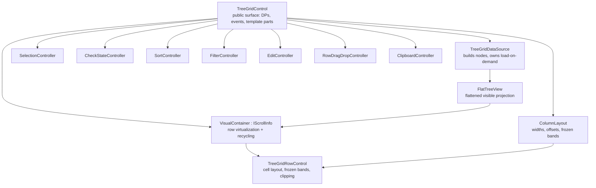

# TreeGrid.Wpf

A multi-column tree grid for WPF, built from scratch for .NET 8. Hierarchical data
binding, row and column virtualization, sorting, Excel-style filtering, editing with
four validation sources, frozen panes, stacked headers, drag-and-drop, clipboard
interop, and export to Excel, CSV and PDF.

Clean-room implementation. No third-party control assemblies are referenced or
decompiled, and the core library has no external dependencies at all.

```xml
<tg:TreeGridControl ItemsSource="{Binding Staff}"
                    ChildPropertyName="Children"
                    AllowSorting="True"
                    AllowFiltering="True"
                    FrozenColumnCount="1">
    <tg:TreeGridControl.Columns>
        <cols:TreeGridTextColumn MappingName="FirstName" HeaderText="First Name" Width="220" />
        <cols:TreeGridNumericColumn MappingName="Salary" HeaderText="Salary" Width="110" />
        <cols:TreeGridProgressBarColumn MappingName="Completion" HeaderText="Progress" />
    </tg:TreeGridControl.Columns>
</tg:TreeGridControl>
```

---

## Contents

- [Requirements and build](#requirements-and-build)
- [Projects](#projects)
- [Quick start](#quick-start)
- [Architecture](#architecture)
- [Data binding](#data-binding)
- [Virtualization](#virtualization)
- [Columns](#columns)
- [Selection](#selection)
- [Sorting](#sorting)
- [Filtering](#filtering)
- [Editing and validation](#editing-and-validation)
- [Frozen panes and stacked headers](#frozen-panes-and-stacked-headers)
- [Row drag and drop](#row-drag-and-drop)
- [Context menus](#context-menus)
- [Clipboard](#clipboard)
- [Export](#export)
- [Theming](#theming)
- [Localization and RTL](#localization-and-rtl)
- [Keyboard reference](#keyboard-reference)
- [Diagnostics](#diagnostics)
- [Events reference](#events-reference)
- [Known limitations](#known-limitations)
- [Licence](#licence)

---

## Screenshots


---

## Requirements and build

- Windows
- .NET 8 SDK with the desktop workload

```bash
dotnet build TreeGrid.sln
dotnet run --project samples/TreeGrid.Demo
```

## Projects

| Project | Dependencies | Purpose |
|---|---|---|
| `TreeGrid.Wpf` | **None** | The control, plus CSV export. |
| `TreeGrid.Wpf.Export` | ClosedXML, QuestPDF | Optional. Reference only if you need xlsx or pdf. |
| `TreeGrid.Demo` | Both | Feature explorer. |

The split is deliberate: an application that only needs CSV should not pull two
document libraries into its output.

## Quick start

```xml
xmlns:tg="clr-namespace:TreeGrid.Wpf;assembly=TreeGrid.Wpf"
xmlns:cols="clr-namespace:TreeGrid.Wpf.Columns;assembly=TreeGrid.Wpf"
xmlns:headers="clr-namespace:TreeGrid.Wpf.Headers;assembly=TreeGrid.Wpf"
```

```csharp
public class Employee
{
    public string FirstName { get; set; }
    public double Salary { get; set; }
    public ObservableCollection<Employee> Children { get; set; } = new();
}

grid.ChildPropertyName = "Children";
grid.ItemsSource = staff;
```

---

## Architecture



Two decisions carry most of the weight.

**The flat view is a single `List<TreeNode>`.** Expanding splices a node's visible
descendants in at one index and reindexes the tail. Nodes cache their own
`FlatIndex`, so "which row is this node?" is O(1) — which the virtualizer needs on
every scroll frame. A rebuild-on-expand design would make unbounded lazy sources
unusable.

**Rows translate their own cells.** The container never applies a horizontal
transform to a row. Each row pins frozen cells at fixed offsets and shifts only the
middle band, clipping it so it cannot bleed under the frozen columns. Frozen panes
therefore need no second panel tree.

---

## Data binding

Three models, selected automatically from which properties you set.

### Hierarchical

Each item exposes a child collection.

```xml
<tg:TreeGridControl ItemsSource="{Binding Staff}" ChildPropertyName="Children" />
```

### Self-relational

A flat list joined by key and parent key.

```xml
<tg:TreeGridControl ItemsSource="{Binding Tasks}"
                    IdPropertyName="Id"
                    ParentIdPropertyName="ParentId" />
```

Cycles and orphans are tolerated: a row whose parent key is missing, or which would
close a loop, is promoted to a root rather than dropped.

### Load on demand

Children are fetched the first time a node is expanded. The grid never needs to know
how large the tree is.

```csharp
grid.DataSource.HasChildNodesResolver = item => ((FolderItem)item).IsFolder;

grid.DataSource.RequestTreeItemsAsync = async (node, token) =>
    await repository.GetChildrenAsync(node.Item, token);
```

A synchronous `RequestTreeItems` event is available as an alternative. Nodes show a
busy indicator while a fetch is in flight, and sorting, filtering and checkbox
cascade are reapplied to children as they arrive.

| Property | Purpose |
|---|---|
| `ItemsSource` | Root collection |
| `ChildPropertyName` | Child collection property (hierarchical) |
| `IdPropertyName` / `ParentIdPropertyName` | Key columns (self-relational) |
| `SelfRelationRootValue` | Parent-key value marking a root |
| `AutoGenerateColumns` | Reflect columns from the first item |
| `DataSource` | `TreeGridDataSource`, for the on-demand hooks |
| `View` | The live `FlatTreeView` |

---

## Virtualization

Row and column virtualization with container recycling. Memory and layout cost track
viewport size, not record count.

| Property | Default |
|---|---|
| `EnableColumnVirtualization` | `true` |
| `RowHeight` | `26` |
| `IndentPerLevel` | `18` |

Row height is uniform; variable heights are not supported.

---

## Columns

| Type | Editor |
|---|---|
| `TreeGridTextColumn` | TextBox |
| `TreeGridNumericColumn` | TextBox, culture-aware parsing, min/max clamp |
| `TreeGridDateTimeColumn` | DatePicker |
| `TreeGridComboBoxColumn` | ComboBox, with `SelectedValuePath` support |
| `TreeGridCheckBoxColumn` | In-place checkbox |
| `TreeGridTemplateColumn` | Your `CellTemplate` / `EditTemplate` |
| `TreeGridProgressBarColumn` | Display only |
| `TreeGridHyperlinkColumn` | Display only |

Shared properties: `MappingName`, `HeaderText`, `Width`, `MinimumWidth`,
`MaximumWidth`, `IsHidden`, `TextAlignment`, `DisplayFormat`, `Padding`,
`CellForeground`, and the `AllowSorting` / `AllowFiltering` / `AllowEditing` /
`AllowResizing` opt-outs. `MappingName` supports dotted paths (`Manager.Name`).

> **Columns are plain `DependencyObject`s with no place in the visual or logical
> tree.** Bindings using `RelativeSource` or `ElementName` will not resolve against
> them. Set a combo column's `ItemsSource` from code-behind or a `StaticResource`.

### Sizing

`ColumnSizer` accepts `None`, `SizeToCells`, `SizeToHeader`, `AllCells`, `Star`,
`LastColumnFill`. Auto-fit measures only *realised* rows — measuring every row would
defeat virtualization — so a column fits what has been scrolled through.

```csharp
grid.AutoFitColumn(column);   // or double-click the resize gripper
grid.AutoFitColumns();
```

Drag the header gripper to resize, the header itself to reorder;
`AllowColumnResizing` and `AllowColumnReordering` gate both.

---

## Selection

```xml
<tg:TreeGridControl SelectionMode="Extended" SelectionUnit="Row" />
```

| Mode | Behaviour |
|---|---|
| `None` | Cursor moves, nothing selects |
| `Single` | One row, modifiers ignored |
| `Multiple` | Click toggles |
| `Extended` | Click replaces, Ctrl toggles, Shift extends from anchor |

Selection is tracked against `TreeNode`, not row index. Collapsing an ancestor or
re-sorting therefore cannot silently reassign the user's selection to whatever slid
into those rows.

### Checkbox selection

```xml
<tg:TreeGridControl AllowCheckBoxSelection="True"
                    CheckBoxCascadeMode="SynchronizeWithParentAndChildren" />
```

Tri-state, cascading down the subtree and rolling up to ancestors. A parent checked
before its children have loaded passes its state down when they arrive.

`SelectedItem`, `SelectedItems`, `CheckedItems`, `CurrentCell`, `SelectAll()`,
`ClearSelection()`.

---

## Sorting

Header click cycles ascending → descending → unsorted. Ctrl-click adds a column to
the sort, with numbered badges.

```csharp
grid.SortColumn("Salary", ListSortDirection.Descending);
grid.SortColumn("LastName", ListSortDirection.Ascending, addToExisting: true);
grid.ClearSorting();
```

**Sorting is level-wise.** Sorting the flattened list would tear children away from
their parents, so each sibling group is sorted independently. Every node records the
order it arrived in, which makes the sort stable and lets "unsorted" restore the true
source order rather than leaving the last sort in place.

```csharp
grid.SortComparers.Add(new SortComparer
{
    ColumnName = "Priority",
    Comparer = new PriorityComparer()
});
```

---

## Filtering

`AllowFiltering="True"` puts a filter button in each header. The popup offers a
searchable value checklist with tri-state Select All, plus two chained conditions
across 14 operators joined by And/Or.

```csharp
grid.FilterPredicate = item => ((Employee)item).Salary > 100000;
grid.ClearFilter("Title");
grid.ClearFilters();
```

### Node modes

A match five levels deep is meaningless without the ancestors giving it context, so
filtering cannot simply drop non-matching rows.

| `FilterNodeMode` | Keeps |
|---|---|
| `MatchingNodesOnly` | Matches alone |
| `MatchingAndParentNodes` | Matches plus ancestors *(default)* |
| `MatchingAndChildNodes` | Matches plus their subtree |
| `MatchingParentAndChildNodes` | Both |

`ExpandNodesOnFiltering` (default true) opens surviving nodes, because a match hidden
under a collapsed parent reads as "found nothing".

> The value checklist is unavailable for unbounded load-on-demand sources — distinct
> values cannot be enumerated from a tree of unknown size. The popup detects this and
> falls back to condition-only filtering.

---

## Editing and validation

```xml
<tg:TreeGridControl AllowEditing="True"
                    EditTrigger="OnDoubleTap"
                    ValidationMode="CellAndRow" />
```

Triggers: `None`, `OnTap`, `OnDoubleTap`, `OnKeyPress`, plus F2 always. Enter commits
and moves down, Tab traverses editable cells across row boundaries, Escape cancels,
clicking away commits — and is blocked if validation refuses.

### Four validation sources

| Source | When |
|---|---|
| DataAnnotations | Candidate value, **before** the write |
| `IDataErrorInfo` | After the write, rolled back on rejection |
| `INotifyDataErrorInfo` | After the write, rolled back on rejection |
| `CellValidating` / `RowValidating` | Your own rules |

The sources disagree about timing, and that ordering is why: annotations can judge a
value that was never assigned, while the interfaces can only report on state the
object already holds. `IEditableObject` provides row-level transactions, so a
multi-cell edit rolls back as a unit.

Errors surface as a red cell border, a corner triangle and a tooltip.

---

## Frozen panes and stacked headers

```xml
<tg:TreeGridControl FrozenColumnCount="2" FooterColumnCount="1" />
```

Left and right bands, with separator lines. Frozen columns hold position during
horizontal scroll because each row arranges its own cells rather than being
translated wholesale.

```xml
<tg:TreeGridControl.StackedHeaderRows>
    <headers:StackedHeaderRow>
        <headers:StackedHeaderRow.StackedColumns>
            <headers:StackedColumn HeaderText="Identity" ChildColumns="FirstName,LastName" />
            <headers:StackedColumn HeaderText="Employment" ChildColumns="Title,Salary" />
        </headers:StackedHeaderRow.StackedColumns>
    </headers:StackedHeaderRow>
</tg:TreeGridControl.StackedHeaderRows>
```

Spans resolve against the live layout on every pass, so stacked headers follow
resize, reorder and freeze.

---

## Row drag and drop

```xml
<tg:TreeGridControl AllowRowDragDrop="True" />
```

Drop above, below, or *into* a row, chosen by pointer position within the row. The
indicator is indented to show the intended parent. A node cannot be dropped into its
own subtree. Children can be promoted to roots and roots demoted to children.

**The grid moves nodes, not your data.** A self-relational source needs a parent-key
rewrite; a hierarchical one needs items moved between child collections. The grid
cannot guess which:

```csharp
grid.RowDropped += (s, e) =>
{
    RelocateInMyModel(e.Nodes, e.TargetNode, e.Position);
    e.HandledByHost = true;   // grid reloads instead of moving nodes itself
};
```

---

## Context menus

```xml
<tg:TreeGridControl ShowDefaultContextMenus="True" />
```

Three regions are hit-tested separately — record, header, and the expander/indent
strip — each with its own menu property (`RecordContextMenu`, `HeaderContextMenu`,
`ExpanderContextMenu`). Stock menus cover sort, filter, auto-fit, freeze, hide and
clipboard.

```csharp
grid.GridContextMenuOpening += (s, e) =>
{
    if (e.Region == GridRegion.Header)
        e.ContextMenu = myHeaderMenu;
};
```

The menu's `DataContext` is a `RecordContextMenuInfo`, `HeaderContextMenuInfo` or
`ExpanderContextMenuInfo` carrying the clicked node and column.

---

## Clipboard

`AllowCopy` and `AllowPaste`, with Ctrl+C / Ctrl+X / Ctrl+V.

Copy writes three formats at once: tab-separated text, CSV, and CF_HTML. Excel
prefers the HTML flavour, which is what preserves table structure instead of dumping
everything into one column.

```csharp
grid.ClipboardController.CopyOptions = GridCopyOptions.IncludeHeaders
                                     | GridCopyOptions.IncludeHierarchyIndent;
grid.ClipboardController.PasteMode = GridPasteMode.FillEmptyOnly;
```

Pasted values go through the same coercion and validation as typed edits, so a bad
paste reports errors rather than corrupting the model.

---

## Export

```csharp
var options = new GridExportOptions
{
    Title = "Staff hierarchy",
    RowScope = ExportRowScope.VisibleRows,
    HierarchyStyle = HierarchyExportStyle.Outline
};

grid.Export(new ExcelExporter(), "staff.xlsx", options);
grid.Export(new PdfExporter(), "staff.pdf", options);
grid.ExportToCsv("staff.csv", options);
```

| Option | Values |
|---|---|
| `RowScope` | `VisibleRows`, `AllRows`, `SelectedRows` |
| `HierarchyStyle` | `Indent`, `LevelColumn`, `Outline`, `None` |
| Also | `IncludeHeaders`, `IncludeHiddenColumns`, `ApplyDisplayFormat`, `RowFilter` |

`Outline` maps the tree onto Excel's own row grouping, so the collapse controls in
the sheet margin mirror your expanders — the hierarchy stays interactive after
export. Excel cells are written typed, not stringified, so sorting and totals work.

Implement `IGridExporter` for your own formats.

---

## Theming

Templates resolve every brush with `DynamicResource`, so a theme is a brush-only
dictionary — no control template needs duplicating.

```xml
<Application.Resources>
    <ResourceDictionary>
        <ResourceDictionary.MergedDictionaries>
            <ResourceDictionary Source="pack://application:,,,/TreeGrid.Wpf;component/Themes/FluentDark.xaml" />
        </ResourceDictionary.MergedDictionaries>
    </ResourceDictionary>
</Application.Resources>
```

`FluentLight.xaml` and `FluentDark.xaml` ship in the box. Swapping the dictionary at
runtime repaints the grid without rebuilding anything. Keys are `TreeGrid.Background`,
`TreeGrid.HeaderBackground`, `TreeGrid.SelectedRowBackground`, `TreeGrid.GridLineBrush`
and so on — see either file for the full set.

---

## Localization and RTL

English defaults are built in, so the grid works with no setup.

```csharp
TreeGridLocalization.ResourceManager = MyStrings.ResourceManager;
TreeGridLocalization.SetString("SelectAll", "(Alle auswählen)");
```

```xml
<Button Content="{loc:Localize SortAscending}" />
```

Any key the resource manager does not carry falls back to English rather than
rendering an empty label. `FlowDirection="RightToLeft"` mirrors the arrange pass.

---

## Keyboard reference

| Key | Action |
|---|---|
| <kbd>↑</kbd> <kbd>↓</kbd> | Move current row |
| <kbd>←</kbd> <kbd>→</kbd> | Collapse / expand (row unit), move cell (cell unit) |
| <kbd>Home</kbd> <kbd>End</kbd> | First / last row |
| <kbd>PgUp</kbd> <kbd>PgDn</kbd> | Page by viewport |
| <kbd>Shift</kbd> + move | Extend selection from anchor |
| <kbd>Ctrl</kbd> + move | Move cursor without changing selection |
| <kbd>Ctrl</kbd>+<kbd>A</kbd> | Select all |
| <kbd>Space</kbd> | Toggle node checkbox |
| <kbd>F2</kbd> | Begin edit |
| <kbd>Enter</kbd> | Commit and move down |
| <kbd>Tab</kbd> / <kbd>Shift</kbd>+<kbd>Tab</kbd> | Commit, move to next/previous editable cell |
| <kbd>Esc</kbd> | Cancel edit, or cancel a drag |
| <kbd>Ctrl</kbd>+<kbd>C</kbd> / <kbd>X</kbd> / <kbd>V</kbd> | Copy / cut / paste |

---

## Diagnostics

```csharp
var results = GridBenchmark.RunStandardSuite(grid);
results.Add(GridBenchmark.MeasureScroll(grid));
Console.WriteLine(GridBenchmark.Format(results));
```

Reports time **and allocation** per operation. The failure mode for a virtualized
grid is rarely slow code — it is garbage. Allocating per scroll frame produces gen-0
collections that read as stutter while the average stays flat.

Two real complexity bugs were found this way and fixed: quadratic cell realization in
the row control, and quadratic range selection on shift-click.

---

## Events reference

| Event | Cancellable |
|---|---|
| `NodeExpanding`, `NodeCollapsing` | ✅ |
| `NodeExpanded`, `NodeCollapsed` | |
| `RequestTreeItems` | |
| `SelectionChanged`, `CurrentCellChanged`, `NodeChecked` | |
| `SortColumnsChanged`, `FilterChanged` | |
| `CellBeginEdit` | ✅ |
| `CellEndEdit` | |
| `CellValidating`, `RowValidating` | ✅ |
| `RowDragStarting` | ✅ |
| `RowDragOver` (via `IsAllowed`), `RowDropped` | ✅ |
| `CopyContent`, `PasteContent` | ✅ |
| `GridContextMenuOpening` | ✅ |

---

## Known limitations

Stated plainly, because several are structural rather than unfinished.

- **Row height is uniform.** Variable-height rows are not supported.
- **Cell merging is parked.** `AllowMergeCells` defaults to false and is fully
  disconnected when off, costing nothing per cell. The implementation is complete and
  its rendering faults are fixed, but it has had no real use. Set
  `AllowMergeCells="True"` to re-enable.
- **Cell-range selection is row-based.** `SelectionUnit="Cell"` tracks and paints a
  current cell, but `Extended` still selects whole rows. Rectangular ranges — and
  therefore rectangular copy — are not implemented.
- **Auto-fit measures realised rows only.** Measuring every row would defeat
  virtualization.
- **Filter value lists need a bounded source.** Load-on-demand sources get
  condition-only filtering.
- **Self-relational sources reload in full** on collection changes. One new row can
  re-parent an arbitrary subtree, so an incremental splice cannot be proven correct.
  Hierarchical and unbound sources splice Add/Remove/Move/Replace in place.
- **RTL mirrors the grid, not the popups.** The filter popup and drag adorners still
  open on the LTR side.
- **Drag and drop moves nodes, not your source collections.** Handle `RowDropped`.
- **Template columns do not commit through the grid** — they edit through their own
  bindings.
- **Benchmark scroll figures are indicative.** `MeasureScroll` drives measure and
  arrange directly rather than through the compositor, so it measures the grid's own
  per-frame work. Use it for regressions, not absolute numbers.

A phase-by-phase build history is in
[`docs/DEVELOPMENT-LOG.md`](docs/DEVELOPMENT-LOG.md).

## Licence

No licence file is included — add one before publishing.

`TreeGrid.Wpf.Export` depends on ClosedXML (MIT) and QuestPDF, whose Community
licence carries revenue-based eligibility terms. Check that QuestPDF's terms fit your
use, or drop the export project entirely; the core library has no dependencies.
